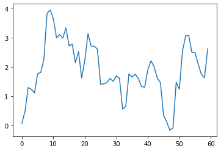
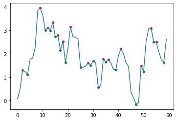

```python
import numpy as np
import scipy.signal
%matplotlib inline
import matplotlib.pyplot as plt
from numpy import *
import math
```


```python
#海浪模拟
myN = 60
timeInterval = 1 #时间间隔
initX = 0 #初始尾椎
Amplitude = np.abs(np.random.randn(1,myN)) #幅值
waveAmplitude = []
Period = np.abs(np.random.randn(1,myN)) #周期
wavePeriod = []
Length = np.abs(np.random.randn(1,myN)) #波长
waveLength = []
Phase = np.abs(np.random.rand(1,myN)) * 2 * math.pi #初相位
initialPhase = []
myWave = 0
waveLine = []
for i in range(1):
    for j in range(myN):
        waveAmplitude.append(Amplitude[i][j])
        wavePeriod.append(Period[i][j])
        waveLength.append(Length[i][j])
        initialPhase.append(Phase[i][j])
for i in range(myN):
    myWave = myWave + waveAmplitude[i] * math.cos(2 * math.pi * initX / waveLength[i] - 2 * math.pi * timeInterval / wavePeriod[i] + initialPhase[i])
    waveLine.append(myWave)


    
plt.plot(waveLine)
print(waveLine)
vector = waveLine
```

    [0.06556448693815964, 0.48010877365777604, 1.292149650972894, 1.232534015634155, 1.105097147208758, 1.7638310993459494, 1.8094460414697913, 2.262134034821895, 3.828558669865555, 3.9522456745611385, 3.6474360029158945, 2.9955173965313513, 3.109392742097828, 2.9851540601930564, 3.3318218141270086, 2.7172061447293805, 2.7815893877959748, 2.144863279349391, 2.520762014699636, 1.6195145861187574, 2.2296596376079063, 3.140466555776065, 2.711045897805552, 2.707713008847286, 2.6089845217357515, 1.4058847009427, 1.4198581214671888, 1.460493854271289, 1.6065391552103285, 1.5003229693917346, 1.692336377013243, 1.6091009616738823, 0.5545723205903348, 0.6439709042427187, 1.7620145113829238, 1.6473217505707638, 1.7505249101535867, 1.6024394889119555, 1.3244156894583319, 1.3040209271175822, 1.9079412735857475, 2.2061391766667335, 2.009238001223155, 1.6098335176291103, 1.4585783307094462, 0.3364794439308636, 0.11616708589186236, -0.17069118625107604, -0.09301239849271171, 1.467839812027258, 1.2332350566514605, 2.534360204481153, 3.0651883547049277, 3.0729952518639423, 2.490244019110559, 2.49040559579102, 2.088725716324906, 1.7420265832476192, 1.625850216063283, 2.6189769774348335]





```python
peakPositions = [] #[0] * len(vector)
valleys = []
diff_v = [0] * (len(vector) - 1)
trend = [0] * (len(vector) - 1)
for i in range(len(diff_v)):
    if vector[i + 1] - vector[i] > 0:
        diff_v[i] = 1;
    elif vector[i + 1] - vector[i] < 0:
        diff_v[i] = -1;
    else:
        diff_v[i] = 0;
trend = diff_v
#对trend作遍历
for i in range(len(diff_v)):
    if diff_v[i] == 0 and len(diff_v) - 1:
        diff_v[i] = 1;
    elif diff_v[i] == 0:
        if diff_v[i+1]>=0:
            diff_v[i] = 1
        else:
            diff_v[i] = -1
for i in range((len(diff_v) - 1)):
    if diff_v[i + 1] - diff_v[i] == -2:
        peakPositions.append(i+1)
    elif diff_v[i + 1] - diff_v[i] == 2:
        valleys.append(i+1)
#得到峰值
peakValue = []
valleyValue = []
for i in range(len(peakPositions)):
    peakValue.append(vector[peakPositions[i]])
for i in range(len(valleys)):
    valleyValue.append(vector[valleys[i]])

#浪高
waveHight = []
for i in range(len(peakValue)):
    waveHight.append(peakValue[i] - valleyValue[i])

print("--WAVE HEIGHT")
print(waveHight)
#print(peakValue)
#print(valleyValue)
#print(peakPositions)
plt.plot(vector)
plt.scatter(peakPositions, peakValue, s=15, c='r')
plt.scatter(valleys, valleyValue, s=15, c='g')
```

    --WAVE HEIGHT
    [0.18705250376413596, 0.9567282780297872, 0.12423868190477139, 0.6146156693976281, 0.6367261084465836, 0.9012474285808787, 1.7345818548333651, 0.10621618581859393, 1.1377640564229081, 0.11469276081215996, 0.44650398303600447, 2.3768303629178096, 0.2346047553757975, 0.5827512327533833, 0.864555379727737]


    <matplotlib.collections.PathCollection at 0x7f93cd7ee490>





```python

```


```python

```


```python

```


```python

```
